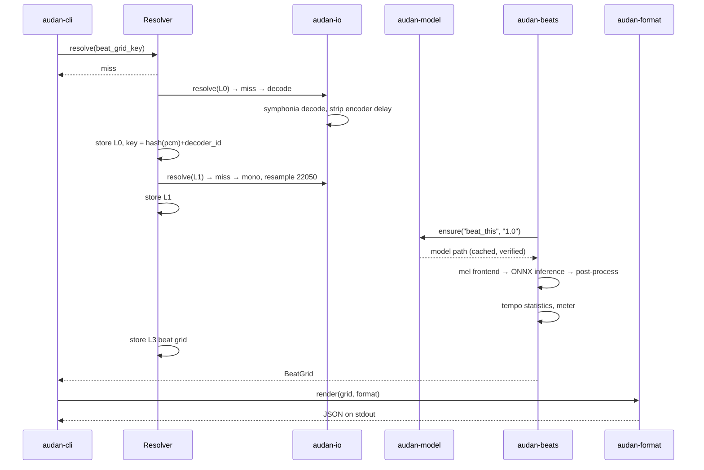
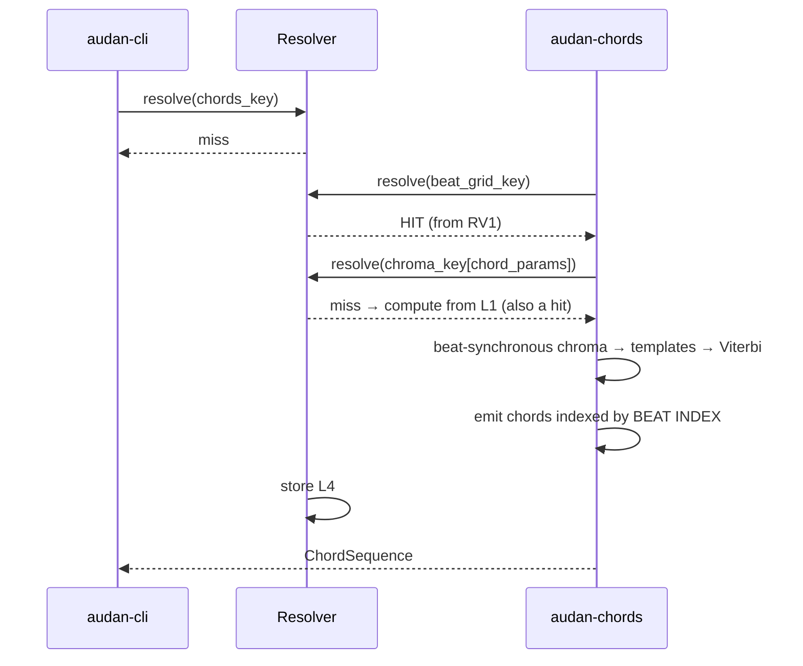

 ba# `audan` — Audio Analysis Utilities
## Architecture Documentation (arc42)

| | |
|---|---|
| **Project** | `audan` — a suite of music-information-retrieval command line utilities |
| **Version** | 0.1 (draft) |
| **Date** | 2026-09-14 |
| **Status** | Proposed |
| **Template** | arc42 7.0 |

> The name is `audan` (**aud**io **an**alysis). It replaces the earlier working name `au`, which was unusable: the crate is taken on crates.io, `AU` is the established abbreviation for Apple's Audio Units plug-in format, `.au` is a legacy audio container, and `au` is already a binary shipped by the Aurelia CLI. See ADR-13. Names reserved on crates.io, npm, and PyPI before first release.

---

## 1. Introduction and Goals

### 1.1 Requirements Overview

`audan` is a suite of command line tools that extract musical structure from recorded audio. Each tool does one thing, reads the common consumer audio formats, and writes standard interchange formats.

| # | Capability | Command | Priority |
|---|---|---|---|
| F1 | Probe a file: format, duration, loudness, clipping, encoder delay | `audan probe` | Must |
| F2 | Estimate the beat grid: beats, downbeats, meter, tempo, tempo fluctuation | `audan beats` | Must |
| F3 | Estimate musical key, with Camelot / Open Key notation | `audan key` | Must |
| F4 | Segment into structural sections (verse / chorus / bridge, or unlabeled A/B/C) | `audan struct` | Should |
| F5 | Transcribe the chord sequence | `audan chords` | Should |
| F6 | Separate instrument stems and report which instruments are present | `audan stems` | Could |
| F7 | Write results back into file metadata tags | `audan tag` | Could |

### 1.2 Quality Goals

Ordered. When two conflict, the higher one wins.

| # | Quality Goal | Motivation | Concrete Target |
|---|---|---|---|
| Q1 | **License cleanliness** | The suite must be usable in commercial and proprietary products without a lawyer. MIR is full of GPL and non-commercial traps (§2.2). | Zero GPL/AGPL/NC dependencies in the shipped binary. Enforced by `cargo deny` in CI. |
| Q2 | **Cross-tool consistency** | A beat grid produced by `audan beats` and consumed by `audan chords` must mean exactly the same thing. Silent timing mismatches are the dominant failure mode in MIR tool suites. | Every timestamp in the system is the centre of its analysis window, in original-signal seconds. Enforced by type, not convention (§8.2). |
| Q3 | **Efficiency under repeated use** | Users analyse the same track with several tools, and analyse libraries of thousands of tracks. Recomputation is the default waste. | Warm-cache invocation < 100 ms wall clock. Cold `audan beats` on a 4-minute track < 6 s on a modern laptop CPU. |
| Q4 | **Operational simplicity** | It is a CLI, not a platform. | Single static binary, no runtime dependencies for the default feature set, no Python, no JVM, no system audio libraries. |
| Q5 | **Honest uncertainty** | Tempo octave and relative-key ambiguity are perceptual, not bugs. Reporting a single number hides irreducible ambiguity. | Every estimator reports ranked candidates with confidences, never a bare point estimate (§8.5). |

### 1.3 Stakeholders

| Role | Expectation |
|---|---|
| DJ / producer | Correct BPM and key, Camelot notation, tags written back to files, batch over a library. |
| Musician / transcriber | Chords and sections aligned to a grid they can correct by hand. |
| MIR researcher | JAMS output, reproducible parameters, ability to swap models. |
| Downstream tool author | Stable JSON schema, meaningful exit codes, machine-readable confidences. |
| Maintainer | Bounded dependency surface, license posture defensible without case-by-case review. |

---

## 2. Architecture Constraints

### 2.1 Technical Constraints

| # | Constraint | Consequence |
|---|---|---|
| TC1 | Implementation language is **Rust** (2021 edition, MSRV pinned in `rust-toolchain.toml`). | Chosen for the permissive-license density of its audio/ML ecosystem and for single-binary distribution. See ADR-1. |
| TC2 | Default build must produce a **statically linkable binary with no native runtime dependency**. | Neural inference defaults to `rten` (pure Rust). ONNX Runtime is an opt-in feature. See ADR-9. |
| TC3 | **No model weights bundled** beyond a small default beat model. | Weights are fetched on demand, checksum-verified, and their licenses surfaced to the user. See ADR-7. |
| TC4 | External binaries may be **invoked as subprocesses but never linked**. | Lets `ffmpeg` (LGPL, or GPL-configured builds) cover exotic formats without license obligations attaching to `audan`. See ADR-8. |
| TC5 | Analysis is **offline and file-based**. No real-time, no streaming input, no network beyond model acquisition. | Simplifies the DSP layer considerably; no latency constraints, arbitrary lookahead permitted. |

### 2.2 Licensing Constraints

This is the constraint that most shapes the design, so it is stated explicitly rather than left to dependency review.

**Excluded — do not introduce under any circumstances:**

| Library | License | Note |
|---|---|---|
| Essentia | AGPL-3.0 | Network copyleft. Commercial license available from MTG but out of scope. |
| aubio | GPL-3.0 | Onset, pitch, beat. Tempting and poisoned. |
| madmom | BSD source, **CC BY-NC-SA 4.0 models** | The source license is a decoy: the trackers are useless without the weights, and the project explicitly requires contacting the author for commercial use of the models or of "technology which utilises them". Treat the whole package as non-commercial. |
| FFTW | GPL-2+ / paid commercial | Use `rustfft` / `realfft` instead. |
| Rubber Band | GPL / commercial | Use `signalsmith-stretch` bindings if time-stretch is ever needed. |
| QM-DSP, Chordino, NNLS Chroma | GPL | The vamp-plugin MIR ecosystem is broadly GPL. |
| TarsosDSP and the JVM MIR stack | GPL-3.0 | Recorded here because it removes the JVM as a platform option; its dependency chain (JTransforms, libresample4j, Minim, BeatRoot) is GPL throughout. |

**Accepted dependency licenses:** MIT, Apache-2.0, BSD-2/3-Clause, ISC, Unlicense/CC0, Zlib, MPL-2.0.

MPL-2.0 (`symphonia`) is accepted deliberately: it is file-level copyleft, so linking does not affect `audan`'s own licensing. The obligation is only to publish modifications to `symphonia`'s own source files. See RISK-6.

**Organisational rule:** `cargo deny check licenses` runs in CI on every commit and fails the build on any license outside the accepted list. A new dependency is an architecture decision, not a convenience.

### 2.3 Conventions

- **Formatting / lints:** `rustfmt` default, `clippy::pedantic` with a documented allow-list.
- **Errors:** `thiserror` in libraries, `anyhow` in the binary only.
- **Public schema:** every JSON output carries a `schema_version`. Breaking changes bump it.
- **Documentation:** this document is the source of truth for cross-cutting decisions. ADRs (§9) are append-only; superseded decisions are marked, never deleted.

---

## 3. Context and Scope

### 3.1 Business Context

```
                    ┌──────────────────────────┐
   audio files ────►│                          │────► analysis JSON / JAMS
   (mp3 flac wav    │                          │
    m4a ogg opus)   │          audan           │────► .lab, Audacity labels
                    │                          │
   user config ────►│  (CLI, offline, local)   │────► stems (wav / flac)
   (analysis.toml)  │                          │
                    │                          │────► updated file tags
   model registry ─►│                          │
   (HTTPS, on       └──────────────────────────┘────► MIDI tempo / click track
    first use)
```

| Partner | Direction | Exchanged |
|---|---|---|
| User (interactive) | in/out | Command invocation; human-readable table on a TTY. |
| User (scripted) | in/out | Flags and config; JSON on stdout; exit code as a signal. |
| Filesystem | in/out | Audio in; results, stems, and cache out. |
| Model registry (HTTPS) | in | ONNX weights, fetched once, checksum-verified, license text surfaced. |
| `ffmpeg` (optional) | out/in | Subprocess for formats `symphonia` does not cover. |
| Downstream tools (DAWs, DJ software, scripts) | out | Standard interchange formats. |

### 3.2 Technical Context

**Inputs**

| Format | Path | Notes |
|---|---|---|
| WAV, FLAC, MP3, AAC/M4A, ALAC, Ogg Vorbis | `symphonia` (MPL-2.0), native Rust | Covers the popular set. AAC-LC and ALAC in MP4 containers are supported natively, which removes the main gap other language choices would have had. |
| Opus, WMA, WavPack, video containers | `ffmpeg` subprocess | Optional. Absence degrades gracefully with a clear error naming the format and suggesting `ffmpeg`. |

Patent note: MP3 patents expired in 2017 and the AAC-LC patent pool has lapsed, so decoding carries no licensing exposure.

**Outputs**

| Artefact | Format | Rationale |
|---|---|---|
| Full analysis | JSON (own schema) | Canonical, versioned, lossless. |
| Full analysis | **JAMS** (ISC) | The MIR community standard; makes `audan` interoperable with existing evaluation tooling. |
| Chords | **`.lab`** — `start end chord`, Harte notation (`C:maj`, `G:7/3`) | De facto standard from Isophonics; consumed by every chord evaluation tool. |
| Sections | `.lab` and **Audacity label track** (`start\tend\tlabel`, tab-separated) | The Audacity track is trivially writable and makes any result audible in seconds. It is the primary debugging instrument (§8.7). |
| Beats | One time per line in seconds (MIREX convention); click-track WAV | |
| Key | `C major`, plus Camelot (`8B`) and Open Key (`1m`) | |
| Tempo map | MIDI tempo track | |
| Stems | WAV or FLAC plus a JSON manifest | |
| Tags | ID3 `TBPM` / `TKEY`, Vorbis `BPM` / `KEY` | Follows Mixed In Key / Rekordbox conventions. |

### 3.3 Out of Scope

Real-time or streaming analysis; audio editing, rendering, or time-stretching; melody or full note-level transcription; lyrics; music generation; a GUI; a server or network service; a plugin host.

---

## 4. Solution Strategy

Five decisions carry most of the architecture.

**S1 — A layered, content-addressed cache keyed on decoded audio, not on the file.**
The expensive work is feature extraction and neural inference, not decoding. Caching at the file level misses the case where the same master arrives in a different container. Caching decoded PCM by content hash means a user's WAV export of their own FLAC hits the same entry. Every layer above is keyed by the hash of the layer below plus a stage version plus a parameter hash, so bumping an algorithm version cascades invalidation for free. Detailed in §8.1.

**S2 — The beat grid is a shared primitive, and downstream results reference beat indices rather than times.**
Key, chords, and structure all quantise to beats. Making the grid a first-class cached artefact means `audan chords` on a track already processed by `audan beats` is nearly free. Referencing beat *indices* means a hand-corrected grid re-times everything downstream without any recomputation. Detailed in §8.3.

**S3 — One frame-time convention, enforced by the type system.**
Padding mode is a legitimate parameter; timestamp reference is not. Every frame timestamp in the system is the centre of its analysis window in original-signal seconds, and the only way to obtain a time from a frame index is through a function that knows the padding mode. This eliminates an entire class of half-window misalignment bugs by construction. Detailed in §8.2.

**S4 — Neural models are pluggable ONNX artefacts, never bundled weights.**
The code license and the weights license are separate, and the weights are where the risk lives. Shipping no weights and fetching them on demand keeps `audan`'s license posture unambiguous and pushes model-specific terms to the point where the user can accept them. Detailed in §8.6.

**S5 — A multi-call single binary with cache-mediated composition.**
`audan beats`, `audan key`, `audan chords` are subcommands of one binary (optionally symlinked). Because every stage resolves its inputs through the cache, the tools compose without piping: `audan chords` simply asks for a beat grid and gets a hit or computes one. Piping remains available for override.

---

## 5. Building Block View

### 5.1 Level 1 — `audan`

```
┌───────────────────────────────────────────────────────────────────────┐
│                               audan-cli                               │
│           argument parsing · config resolution · rendering            │
└───────────────────────────────┬───────────────────────────────────────┘
                                │
┌───────────────────────────────▼───────────────────────────────────────┐
│                        Analysis stages (L3–L5)                        │
│  audan-beats   audan-key   audan-chords   audan-struct   audan-stems  │
└───────────────────────────────┬───────────────────────────────────────┘
                                │
┌───────────────────────────────▼───────────────────────────────────────┐
│                        audan-dsp (L2 features)                        │
│        STFT · CQT · chroma · onset envelope · tempogram · SSM         │
└───────────────────────────────┬───────────────────────────────────────┘
                                │
┌───────────────────────────────▼───────────────────────────────────────┐
│                           audan-io (L0–L1)                            │
│            decode · encoder-delay strip · resample · tags             │
└───────────────────────────────────────────────────────────────────────┘

        ┌────────────────┐  ┌────────────────┐  ┌────────────────┐
        │   audan-core   │  │  audan-cache   │  │  audan-format  │
        │  shared types  │  │   CAS store    │  │    writers     │
        └────────────────┘  └────────────────┘  └────────────────┘
                     (used by every layer above)

        ┌────────────────┐
        │  audan-model   │  registry · fetch · verify · license gate
        └────────────────┘
```

| Crate | Responsibility | Key dependencies (license) |
|---|---|---|
| `audan-cli` | Subcommand dispatch, config resolution, TTY vs pipe rendering, exit codes. The only crate allowed to use `anyhow`. | `clap` (MIT/Apache-2.0) |
| `audan-core` | Shared domain types: `FrameTime`, `FrameGrid`, `BeatGrid`, `Chroma`, `Candidate<T>`, `Confidence`, error taxonomy. **No I/O, no DSP.** | `serde` (MIT/Apache-2.0) |
| `audan-cache` | Content-addressed blob store, key derivation, compression, index, garbage collection. | `blake3` (CC0/Apache-2.0), `redb` (MIT/Apache-2.0), `zstd` (BSD) |
| `audan-io` | Decode to `f32`, strip encoder delay, resample to canonical rates, read/write tags, `ffmpeg` fallback. | `symphonia` (MPL-2.0), `rubato` (MIT), `hound` (Apache-2.0), `lofty` (MIT/Apache-2.0) |
| `audan-dsp` | Windowing, STFT, constant-Q, chroma variants, onset strength, tempogram, self-similarity matrices, eigendecomposition. | `rustfft`/`realfft` (MIT/Apache-2.0), `ndarray` (MIT/Apache-2.0), `nalgebra` (Apache-2.0) |
| `audan-model` | Model registry manifest, HTTPS fetch, checksum verification, license presentation and acceptance, cache-dir placement. | `ureq` (MIT/Apache-2.0), `sha2` (MIT/Apache-2.0) |
| `audan-beats` | Beat This! inference plus post-processing; tempo statistics, meter, stability classification. | `rten` (MIT) or `ort` (MIT/Apache-2.0) |
| `audan-key` | Chroma aggregation, Krumhansl/Temperley/Shaath profile correlation, Camelot and Open Key mapping. | `audan-dsp` only |
| `audan-chords` | Beat-synchronous chroma, chord templates, HMM with Viterbi decoding, Harte-notation rendering. | `audan-dsp` only |
| `audan-struct` | Self-similarity, Foote novelty, spectral clustering segmentation, optional section labelling. | `audan-dsp`, `nalgebra` |
| `audan-stems` | Pluggable separation backends, chunked inference, overlap-add reconstruction, stem manifest. | `audan-model`, inference backend |
| `audan-format` | Writers for JSON, JAMS, `.lab`, Audacity labels, MIREX times, MIDI, click tracks. | `serde_json` (MIT/Apache-2.0), `midly` (MIT) |

**Dependency rule:** the arrows point strictly downward. `audan-core` depends on nothing internal. Analysis stages never call `audan-io` directly; they request cached artefacts. Enforced by a CI check on the workspace dependency graph.

### 5.2 Level 2 — `audan-cache`

The heart of the design.

#### How it works

A **hash** is a fingerprint of content: the same bytes in always give the same fingerprint out, and different bytes almost never collide. A **key** is a fingerprint of a *question* — "the beat grid, algorithm version 3, with these parameters, for this audio."

Every stage asks the `Resolver` for its key before computing anything. If the key is present in the index, the stored answer comes back and no work happens. If not, the stage computes, and the result is filed under that key.

Keys chain. A stage's key contains the hash of its input, which in turn contains the hash of *its* input, down to the decoded samples. So changing the audio changes every key above it and the whole chain recomputes; leaving the audio alone but bumping one stage's version misses only that stage and its descendants.

Two useful properties fall out for free. Identical audio in different containers shares one entry, because L0 is keyed by decoded samples rather than file bytes. And invalidation needs no bookkeeping — there is no dependency table to maintain, because the dependency is already inside the key.

#### Components

| Component | Responsibility |
|---|---|
| `KeyDeriver` | Builds a cache key from `(parent_hash, stage_id, stage_version, params_hash)`. The only place key composition logic exists. |
| `BlobStore` | Content-addressed storage of `f32` arrays and JSON. Zstd compression, atomic writes via temp-file-and-rename. |
| `Index` | `redb` embedded key-value store mapping cache keys to blob digests plus metadata (size, created, last-accessed). Pure Rust, no SQLite C dependency. |
| `Resolver` | The single entry point for stages: `resolve(key, || compute())`. Hit returns the blob; miss runs the closure, stores, returns. Handles concurrent computation of the same key via a lock file. |
| `Evictor` | LRU eviction against a configurable size budget; backs `audan cache prune`, `audan cache clear`, `audan cache stats`. |

**Cache layers**

| Layer | Content | Key formula |
|---|---|---|
| **L0** | Decoded PCM at native rate and channel count | `hash(file_bytes) + decoder_id + decoder_version` |
| **L1** | Canonical analysis signal: mono `f32`, 22050 Hz (analysis) and 44100 Hz (stems) | `hash(L0_samples) + resample_params` |
| **L2** | Cheap features: onset envelope, CQT, chroma (per parameter set), tempogram | `hash(L1) + stage_id + stage_version + params_hash` |
| **L3** | **Beat grid** | as above |
| **L4** | Key, chords, sections (beat-referenced) | as above, plus `hash(L3)` |
| **L5** | Stems, raw model outputs | as above |

`decoder_id` is part of the L0 key for a specific reason: MP3 encoder delay and padding are handled differently by different decoders, so two decoders can disagree by roughly 26 ms on where the music starts. That offset propagates straight into the beat grid. See §8.4.

### 5.3 Level 3 — `audan-beats`

| Component | Responsibility |
|---|---|
| `MelFrontend` | Log-mel spectrogram matching the Beat This! input contract (128 bands). Runs as a separate small ONNX graph for exact parity with the reference implementation. |
| `BeatModel` | ONNX session wrapper; chunked inference over long files; backend-agnostic across `rten` and `ort`. |
| `PostProcessor` | Minimal post-processing: max-pool peak picking, deduplication, downbeat snapping. Deliberately **not** a DBN — the Beat This! authors show DBN post-processing adds metrical rigidity, and madmom's DBN is non-commercially licensed anyway (§2.2). |
| `TempoAnalyser` | Derives tempo candidates from the inter-beat-interval distribution; separates jitter from drift; classifies stability. |
| `MeterEstimator` | Beats-per-bar from the downbeat sequence, with confidence. |

---

## 6. Runtime View

### 6.1 RV1 — Cold analysis: `audan beats track.mp3`



Dominant cost is neural inference, which scales linearly with duration. On a modern laptop CPU a 4-minute track lands in the 4–5 second range; decode and resampling are well under a second.

### 6.2 RV2 — Warm dependent analysis: `audan chords track.mp3`



No piping, no re-decoding, no re-tracking of beats. This is the payoff for S1 and S2 together.

Note that the chroma computed here uses different parameters from the chroma `audan key` would use — key estimation wants long windows and heavy smoothing, chord estimation wants beat-synchronous frames and harmonic suppression. They are therefore distinct cache entries under distinct `params_hash` values and must never share one.

### 6.3 RV3 — Batch: `audan beats ~/Music/**/*.flac -j 8`

A `rayon` worker pool over the file list. Each worker drives its own `Resolver`; the index handles concurrent access, and per-key lock files prevent two workers duplicating the same computation when a library contains duplicate masters. A single shared ONNX session is reused across workers, since session creation is expensive relative to inference on short files. Progress on stderr, results on stdout as JSON Lines, so the stream stays pipeable.

### 6.4 RV4 — First use of a model: `audan stems track.wav --model htdemucs`

1. `audan-stems` requests the model from `audan-model`.
2. Not present in `$XDG_CACHE_HOME/audan/models/`.
3. `audan-model` prints the model's name, size, source URL, and **its license terms, including any ambiguity** (see RISK-1), then requires explicit confirmation (`--accept-model-license` in non-interactive contexts).
4. Download, verify SHA-256 against the registry manifest, store atomically.
5. Inference proceeds.

Step 3 is not a formality. It is the mechanism by which `audan` keeps its own license posture clean while still being useful.

### 6.5 RV5 — Hand-corrected grid

`audan beats track.mp3 > grid.json`, user edits, then `audan chords track.mp3 --beats grid.json`. The supplied grid overrides cache resolution for L3. Because chords are stored against beat indices, `audan struct` and `audan chords` results computed from the corrected grid re-time consistently. The `frames` block in the supplied file is validated against the current configuration and rejected loudly on mismatch (§8.2).

---

## 7. Deployment View

### 7.1 Distribution

Single binary, no installer.

| Target | Build | Notes |
|---|---|---|
| Linux x86-64 / aarch64 | `x86_64-unknown-linux-musl` etc. | Fully static with the default `rten` backend. |
| macOS arm64 / x86-64 | Universal binary | Signed and notarised. |
| Windows x86-64 | MSVC toolchain | |

Feature flags:

| Feature | Default | Effect |
|---|---|---|
| `rten` | on | Pure-Rust inference. No system libraries. |
| `ort` | off | ONNX Runtime backend. Faster on some workloads and supports GPU execution providers, but requires `libonnxruntime` at runtime and breaks the static-binary property. |
| `ffmpeg` | on | Enables subprocess fallback *if* `ffmpeg` is found on `PATH`. Never links it. |

Keeping both backends alive also gives a cheap correctness check: a cross-runtime test asserts the two agree on beat timestamps within MIR tolerance on a real signal.

### 7.2 Filesystem Layout

```
$XDG_CONFIG_HOME/audan/analysis.toml     canonical analysis parameters
$XDG_CACHE_HOME/audan/blobs/             content-addressed blob store
$XDG_CACHE_HOME/audan/index.redb         cache index
$XDG_CACHE_HOME/audan/models/            downloaded ONNX weights + license texts
```

All four respect the XDG base-directory spec with platform-appropriate fallbacks. Cache location is overridable by `AUDAN_CACHE_DIR` for CI and sandboxed use.

### 7.3 Build Pipeline

`cargo fmt --check` → `cargo clippy -- -D warnings` → `cargo deny check licenses advisories` → `cargo test` (including the click-train canary suite, §8.7) → cross-compile matrix → sign → release.

`cargo deny` failing is a hard stop, not a warning. Q1 is the top quality goal and this is its only enforcement point.

---

## 8. Cross-cutting Concepts

### 8.1 Cache Key Derivation

```rust
pub struct CacheKey(blake3::Hash);

impl KeyDeriver {
    pub fn derive(
        parent: Option<&CacheKey>,
        stage_id: &str,       // "beats", "chroma", "cqt"
        stage_version: u32,   // bumped on any algorithm change
        params: &impl Hash,   // canonical, order-independent
    ) -> CacheKey { /* ... */ }
}
```

Three properties matter:

- **`stage_version` is the invalidation lever.** Changing an algorithm means bumping it, and every descendant key changes automatically. There is no manual invalidation path and no "clear the cache" ritual in the release process.
- **`params` hashing must be canonical.** Serialise to a sorted, normalised form before hashing so that logically identical parameter sets produce identical keys regardless of construction order.
- **Blobs are immutable.** Writes go to a temp file and are renamed. Interrupted runs leave garbage, never corruption.

### 8.2 Frame Time Convention

Two decisions are routinely conflated, and the conflation is the bug:

1. **Padding** — is the signal padded at the edges so a frame exists centred on sample 0?
2. **Timestamp reference** — does frame *k*'s time denote the window's start or its centre?

`librosa` fuses these. With `center=True` it pads by `n_fft//2` and `frames_to_time` returns `k*hop/sr`, which is the window centre in original coordinates. With `center=False` there is no padding, frame *k* spans `[k*hop, k*hop+n_fft)`, and the same function returns `k*hop/sr` — now the window *start*. Same call, different meaning, off by half a window.

`audan` separates them:

- **Padding is a parameter.** It genuinely affects edge behaviour, frame count, and onset detection near t=0. Exposed as `--pad none|zero|reflect` and folded into `params_hash`.
- **Timestamp reference is not a parameter, ever.** Every frame timestamp in the system is the window centre in original-signal seconds.

The convention is enforced structurally, not documented and hoped for:

```rust
/// Seconds at the CENTRE of an analysis window, in original-signal
/// coordinates (i.e. with any padding already accounted for).
/// There is no other time convention in this codebase.
#[derive(Copy, Clone, PartialEq, PartialOrd, Debug)]
pub struct FrameTime(f64);

pub struct FrameGrid {
    pub sample_rate: u32,
    pub hop: usize,
    pub win: usize,
    pub pad: PadMode,
}

impl FrameGrid {
    pub fn time_of(&self, k: usize) -> FrameTime {
        match self.pad {
            // unpadded: frame k spans [k*hop, k*hop+win)
            PadMode::None => FrameTime((k * self.hop + self.win / 2) as f64
                                        / self.sample_rate as f64),
            // padded: frame 0 is centred on sample 0
            _             => FrameTime((k * self.hop) as f64
                                        / self.sample_rate as f64),
        }
    }
}
```

There is no public constructor for `FrameTime` from a raw `f64` outside `audan-core`, and no route from a frame index to a time except `time_of`, which knows the padding mode. A stage physically cannot apply the wrong formula.

Every output stamps the convention so that foreign data fails loudly rather than misaligning silently:

```json
"frames": { "sr": 22050, "hop": 512, "win": 2048,
            "pad": "reflect", "t_ref": "window_center" }
```

The window function (Hann by default) is part of `params_hash` but deliberately **not** a user-facing flag: changing it shifts feature statistics enough to invalidate tuned thresholds, and exposing it would generate confusing bug reports for no practical gain.

### 8.3 The Beat Grid as Shared Primitive

```json
{
  "schema_version": 1,
  "beats": [0.512, 0.973, 1.441],
  "downbeats": [0, 4, 8],
  "meter": { "beats_per_bar": 4, "confidence": 0.91 },
  "tempo": {
    "median_bpm": 128.02,
    "candidates": [ { "bpm": 128.0, "conf": 0.88 },
                    { "bpm": 64.0,  "conf": 0.09 } ],
    "stability": { "ibi_mad_ms": 0.8,
                   "drift_bpm_per_min": 0.0,
                   "class": "programmed" }
  },
  "confidence": [0.95, 0.93],
  "frames": { "sr": 22050, "hop": 512, "win": 2048,
              "pad": "reflect", "t_ref": "window_center" },
  "source": { "algo": "beat_this", "version": "1.0", "postproc": "minimal" }
}
```

Three design points:

**Candidates, not a tempo.** Octave ambiguity (87 vs 174 BPM) is the leading failure mode and is not fixable — it is genuine perceptual ambiguity. Exposing ranked candidates lets downstream tools and users resolve it with context the estimator lacks.

**Jitter and drift are separate measurements.** The MAD of inter-beat intervals captures a drummer's micro-timing; a linear fit across the tempo curve captures a tape slowdown or a deliberate accelerando. Collapsing both into "±2 BPM" discards the distinction between *human* and *sped up in post*. The `class` field (`programmed` / `human` / `drifting` / `variable`) is what users actually want to read.

**Downstream artefacts reference beat indices, not times.** Chords and sections store `{ start_beat: 16, end_beat: 32 }`. Correcting the grid re-times everything below it without recomputation, which is what makes RV5 cheap.

### 8.4 Decoder Identity and Encoder Delay

MP3 and AAC encoders insert priming samples, and the LAME/Xing and iTunSMPB tags record how many to discard. Decoders that ignore them start the music roughly 26 ms late. That offset lands directly in the beat grid.

`audan` therefore:

1. **Always strips encoder delay** when the container declares it, and records `delay_stripped_samples` in the probe output.
2. **Pins `decoder_id` and `decoder_version` into the L0 cache key**, so a `symphonia` upgrade that changes gapless handling invalidates cleanly rather than mixing conventions across cache entries.
3. **Records the decoder in every output**, so a timing discrepancy against another tool is diagnosable rather than mysterious.

The same reasoning applies to the `ffmpeg` fallback path: the `ffmpeg` version string is part of `decoder_id`.

### 8.5 Confidence and Ambiguity

A single generic type carries ranked alternatives throughout:

```rust
pub struct Candidate<T> { pub value: T, pub confidence: f32 }
pub struct Ranked<T>(Vec<Candidate<T>>);  // sorted descending, non-empty
```

Key estimation returns the top three (relative major/minor confusion is irreducible from chroma alone). Tempo returns candidates across metrical levels. Meter returns candidates. `--strict` makes the process exit non-zero when the top candidate's confidence falls below a threshold, so low-confidence results can be caught in scripts rather than silently trusted.

Human-readable output shows only the top candidate unless `-v`; JSON always carries the full ranking.

### 8.6 Model Management

| Concern | Approach |
|---|---|
| Distribution | A signed registry manifest lists models with URL, SHA-256, size, license identifier, and license text URL. |
| Bundling | Only the small default beat model is embedded via `include_bytes!`, so a bare `audan beats` works with no network. Full-accuracy models are fetched. |
| Verification | SHA-256 against the manifest before the file is moved into place. |
| License surfacing | Presented before download, recorded in `models/<name>/LICENSE`, and referenced from the `source` block of any output produced with it. |
| Backends | Trait-based: `trait Separator { fn separate(&self, audio: &Signal) -> Result<Stems>; }`. Backend choice is a runtime flag, never a compile-time assumption. |

**Beat tracking** uses Beat This! (ISMIR 2024, Foscarin/Schlüter/Widmer). Code and published weights are both MIT — a genuine rarity in this space — and the model was specifically designed not to need DBN post-processing. The authors note that some training files are fully copyrighted or under limited Creative Commons licenses and leave that assessment to the user; this is recorded as RISK-3 rather than hidden. Existing Rust and C++ ONNX ports of the model provide a reference for the frontend and post-processing contract.

**Source separation** ships no default. The user chooses and accepts terms. See RISK-1.

**Chord estimation** uses no neural model at all: chroma, chord templates, and an HMM with Viterbi decoding (following Sheh & Ellis 2003 and Bello & Pickens 2005). This is a deliberate accuracy sacrifice for license cleanliness. See RISK-2.

### 8.7 Testing and the Timing Canary

The single highest-value test in the project:

> Synthesise a click train at known sample positions. Run every feature extractor. Assert that detected peaks land within 1 ms of ground truth. Run across the full cross-product of padding modes, hop sizes, and sample rates.

One test kills the entire class of half-window misalignment bugs. A variant with prepended silence and a re-encoded MP3 round trip catches encoder-delay regressions at the same time.

Beyond that:

| Layer | Approach |
|---|---|
| DSP kernels | Property tests (Parseval's theorem for the STFT, round-trip identity for CQT). |
| Cache | Property tests: identical inputs produce identical keys; a `stage_version` bump changes every descendant key; concurrent resolution of one key computes once. |
| Estimators | Evaluation against permissively licensed reference annotation sets, reporting standard MIREX metrics. Regression thresholds fail CI. |
| Formats | Round-trip through `.lab`, JAMS, and Audacity writers and readers. |
| Cross-runtime | `rten` and `ort` agree on beat timestamps within MIR tolerance on a real signal. |

### 8.8 Configuration Resolution

Precedence, lowest to highest: compiled defaults → `$XDG_CONFIG_HOME/audan/analysis.toml` → `AUDAN_*` environment variables → command-line flags.

The **resolved** parameter set is stamped into every output. Given any `audan` JSON file, the exact analysis can be reproduced without knowing the user's environment. This is the reproducibility guarantee, and it costs almost nothing to maintain.

### 8.9 CLI Conventions

```
audan probe   file.mp3               format, duration, loudness, clipping, delay
audan beats   file.mp3               beat grid
audan key     file.mp3
audan chords  file.mp3
audan struct  file.mp3
audan stems   file.mp3 --model <id>
audan tag     file.mp3 --write bpm,key
audan cache   stats | prune | clear
```

| Convention | Behaviour |
|---|---|
| stdout | JSON when piped; human-readable table when a TTY. |
| `--format` | `json` \| `jams` \| `lab` \| `csv` \| `audacity` \| `midi` |
| `-q` | One line: `128.02 4/4 Amin` |
| `-j N` | Parallel workers for batch input. |
| stderr | Progress, warnings, diagnostics. Never data. |
| Exit codes | `0` success; `1` runtime error; `2` usage error; `3` low confidence under `--strict`; `4` unsupported format. |

Subcommands may be symlinked (`audan-beats` → `audan`) for users who prefer discrete tools; `argv[0]` dispatch handles it.

---

## 9. Architecture Decisions

Append-only. Superseded entries are marked, never removed.

### ADR-1 — Implement in Rust
**Status:** Accepted · **Context:** Candidates were Rust, Go, Kotlin/JVM, C++, and Python. **Decision:** Rust. **Rationale:** The decisive factor is that the Rust audio and ML ecosystem is permissively licensed almost end to end (`symphonia` MPL-2.0, `rustfft` MIT/Apache-2.0, `rubato` MIT, `ort`/`rten` MIT), whereas the JVM MIR ecosystem is GPL throughout and Go lacks a native AAC decoder and any SIMD story. Rust also gives single-binary distribution (Q4) and ~5 ms startup, which matters for shell-loop batch use. A working Rust ONNX port of Beat This! already exists as a reference. **Consequences:** Steeper contribution curve; smaller MIR library ecosystem than Python, so more is written in-house (which is partly the point, given §2.2).

### ADR-2 — Multi-call single binary
**Status:** Accepted · **Decision:** One binary with subcommands, optionally symlinked. **Rationale:** Shared cache, shared model sessions, one startup cost, one thing to install. **Consequences:** Binary is larger than any single tool would be; subcommands cannot be versioned independently.

### ADR-3 — Cache keyed on decoded audio content
**Status:** Accepted · **Decision:** L0 is keyed by `hash(file_bytes) + decoder_id`; L1 and above are keyed by `hash(parent) + stage_version + params_hash`. **Rationale:** The expensive work is above decoding. Content addressing makes re-encodes of the same master share entries and makes invalidation automatic. **Consequences:** Lossy re-encodes will not share entries (accepted — they are genuinely different signals). Cache can grow large; requires GC.

### ADR-4 — Beat grid is the shared primitive; downstream references beat indices
**Status:** Accepted · **Decision:** Chords and sections store beat indices, not times. **Rationale:** Makes dependent analyses nearly free and makes hand-correction of the grid re-time everything downstream without recomputation. **Consequences:** A beat grid must exist before chords or structure. Rendering to time-based formats requires a grid lookup.

### ADR-5 — One timestamp convention, enforced by type; padding is a parameter
**Status:** Accepted · **Decision:** All frame times are window centres in original-signal seconds, expressed as a `FrameTime` newtype with no public raw constructor. `PadMode` is a parameter. **Rationale:** Eliminates half-window misalignment structurally rather than by discipline. **Consequences:** Slightly more ceremony at API boundaries. Foreign data must be validated and may be rejected.

### ADR-6 — Beat This! as the beat tracking backend
**Status:** Accepted · **Decision:** Beat This! via ONNX, with minimal post-processing and no DBN. **Rationale:** MIT code *and* MIT weights, state-of-the-art accuracy, explicitly designed to work without DBN post-processing. madmom — the obvious alternative — is CC BY-NC-SA on all its models. **Consequences:** Dependency on a single research group's release. The training-data caveat is inherited (RISK-3). Mitigated by the backend being trait-based and swappable.

### ADR-7 — Ship no model weights beyond a small default
**Status:** Accepted · **Decision:** Weights are fetched on first use, verified, and their licenses presented for acceptance. **Rationale:** Code license and weights license are independent, and weights carry the real risk. Not redistributing them keeps `audan`'s own posture unambiguous while remaining useful. **Consequences:** First use of a model requires network access. Offline installation needs a documented sideload path.

### ADR-8 — `ffmpeg` as optional subprocess, never linked
**Status:** Accepted · **Decision:** Exotic formats fall back to invoking `ffmpeg` as a child process. **Rationale:** A process boundary is not linking, so LGPL (and even GPL-configured build) obligations do not attach to `audan`. **Consequences:** Optional runtime dependency; must be absent-tolerant with a clear error. `ffmpeg` version becomes part of `decoder_id`.

### ADR-9 — `rten` default, `ort` optional
**Status:** Accepted · **Decision:** Pure-Rust inference by default; ONNX Runtime behind a feature flag. **Rationale:** Preserves the no-runtime-dependency property (Q4) and trivial cross-compilation, at some performance cost. **Consequences:** Two backends to maintain — partly offset by the cross-runtime agreement test being a genuine correctness check.

### ADR-10 — Adopt existing interchange formats
**Status:** Accepted · **Decision:** JAMS, Harte-notation `.lab`, Audacity label tracks, MIREX time lists, MIDI tempo tracks. Own JSON only as the canonical superset. **Rationale:** Interoperability with existing MIR and DAW tooling is free; inventing a format is not. **Consequences:** Some `audan` information has no home in the standard formats and is lossy on export; documented per format.

### ADR-11 — Report ranked candidates, never bare point estimates
**Status:** Accepted · **Decision:** Tempo, key, and meter all return `Ranked<T>`. **Rationale:** Octave and relative-key ambiguity are perceptual and irreducible; hiding them produces confidently wrong output. **Consequences:** Slightly more complex schema and consuming code. Mitigated by `-q` for the common case.

### ADR-12 — Hand-write chord estimation rather than use a neural model
**Status:** Accepted · **Decision:** Chroma, templates, HMM, Viterbi. **Rationale:** No state-of-the-art chord model currently has unambiguously permissive weights. Q1 outranks accuracy. **Consequences:** Roughly 75–80% majmin accuracy against ~90%+ for current neural systems. Revisit if permissively licensed weights appear (RISK-2).

### ADR-13 — Name the suite `audan`, not `au`
**Status:** Accepted · **Context:** `au` was the working name through the 0.1 draft. **Decision:** Rename to `audan` (**aud**io **an**alysis) for the binary, the crate, and the workspace prefix (`audan-core`, `audan-dsp`, …). **Rationale:** `au` collided four ways, three of them inside this domain: the `au` crate on crates.io is taken (an automatic-control-systems library); `AU` is the standard abbreviation for Audio Units, Apple's plug-in architecture — a capability §3.3 explicitly excludes; `.au` is the legacy Sun/NeXT audio container, so `audan probe file.au` would be a permanent FAQ; and the npm `au` package (the Aurelia CLI) installs a binary of that name, creating a `PATH` collision on developer machines. Residual noise: `Au` is Adobe Audition's abbreviation, gold's symbol, and the Australian ccTLD. `audan` is unregistered on crates.io, npm, and PyPI, as is the full `audan-*` workspace prefix. **Consequences:** Two characters more to type than a minimal name. Environment variables become `AUDAN_*` and cache/config directories move to `$XDG_*_HOME/audan/`; as this predates any release there is no migration path to write. Registry placeholders should be claimed now rather than at release.

---

## 10. Quality Requirements

### 10.1 Quality Tree

```
Usefulness
├── License cleanliness (Q1)
│   ├── No copyleft or NC in the shipped artefact
│   └── Weights licensing explicit and user-accepted
├── Correctness (Q2)
│   ├── Cross-tool timing consistency
│   ├── Estimator accuracy on reference sets
│   └── Reproducibility from stamped parameters
├── Efficiency (Q3)
│   ├── Cold-run latency
│   ├── Warm-cache latency
│   └── Batch throughput
├── Operability (Q4)
│   ├── Single-artefact install
│   └── Scriptability
└── Honesty (Q5)
    └── Ambiguity surfaced, not hidden
```

### 10.2 Quality Scenarios

| # | Goal | Scenario | Target |
|---|---|---|---|
| QS1 | Q1 | A new dependency with a GPL transitive is added in a pull request. | CI fails on `cargo deny check licenses` before review. |
| QS2 | Q2 | `audan beats` and `audan chords` are run on the same track. | Chord boundaries align to beat times exactly, by construction — chords are stored as beat indices. |
| QS3 | Q2 | A click train with impulses at known samples is analysed at every padding mode and hop size. | Every detected peak within 1 ms of ground truth. |
| QS4 | Q2 | The same file is analysed as FLAC and as a lossless WAV export of that FLAC. | Identical L1 hash, identical results, one computation. |
| QS5 | Q3 | `audan beats` on a 4-minute track, cold cache, modern laptop CPU. | < 6 s wall clock. |
| QS6 | Q3 | `audan key` immediately after `audan beats` on the same track. | < 100 ms. |
| QS7 | Q3 | 10,000-track library, `-j 8`. | Linear scaling to core count; memory bounded by worker count, not library size. |
| QS8 | Q4 | Fresh machine, no toolchain, no Python, no network after download. | Binary runs `audan beats` using the embedded default model. |
| QS9 | Q5 | A track at 87 BPM with strong eighth-note subdivision. | Both 87 and 174 appear as candidates with confidences; neither is silently discarded. |
| QS10 | Q2 | An MP3 and its FLAC source are analysed; beat times compared. | Difference < 5 ms — encoder delay stripped, not inherited. |

---

## 11. Risks and Technical Debt

| # | Risk | Severity | Mitigation |
|---|---|---|---|
| **RISK-1** | **Demucs weights licensing is genuinely unresolved.** The code is MIT, but the author stated in repository issues (#267, #327, #508) that the weights are not covered by MIT and are provided for research purposes, citing MUSDB dataset terms — while a later Hugging Face model card carries an `mit` license tag. The contradiction is unresolved. | High | Ship no weights (ADR-7). Present the ambiguity verbatim at download time. Keep the separator backend trait-based so a cleanly licensed model can be adopted the moment one exists. Do not make any separation model the default. |
| **RISK-2** | **No permissively licensed state-of-the-art chord model exists.** Chordino is GPL, madmom's deep chroma is NC, and research models are mostly unlicensed code. | Medium | Accept a lower accuracy ceiling (ADR-12). Design the chord stage so a model backend can slot in behind the same interface. Track the field. |
| **RISK-3** | **Beat This! training-data caveat.** The authors note some training files are fully copyrighted or under limited CC licenses and leave the assessment to the user. | Low–Medium | Record in the model license text presented to users. This is materially better than every alternative, but it is not zero. Backend remains swappable. |
| **RISK-4** | **`rten` maturity.** Younger and less battle-tested than ONNX Runtime; may have operator gaps or performance cliffs on new models. | Medium | `ort` available behind a feature flag. Cross-runtime agreement test in CI catches divergence early. |
| **RISK-5** | **`symphonia` format coverage gaps.** Opus, WMA, and video containers are not covered natively. | Low | `ffmpeg` fallback (ADR-8), with a clear error naming the missing format when unavailable. |
| **RISK-6** | **MPL-2.0 obligations on `symphonia`.** If `audan` ever patches `symphonia` source files, those modifications must be published. | Low | Prefer upstream contributions over vendored patches. If vendoring becomes necessary, keep it in a clearly marked separate directory with its own license header. |
| **RISK-7** | **Cache invalidation storms.** A `stage_version` bump on a low layer invalidates everything above it across a user's whole library. | Low | Bump deliberately and document it in release notes. Provide `audan cache stats` and `audan cache prune` so users can see and bound what a version bump will cost before upgrading. |
| **RISK-8** | **Section labelling is much harder than section segmentation.** Producing unlabeled A/B/C boundaries is tractable; reliably naming one of them "chorus" is not. | Medium | Ship unlabeled segments first. Treat labelling as a separate, clearly experimental flag. Do not let it block F4. |
| **RISK-9** | **Single-maintainer dependency concentration.** Several key crates have small maintainer teams. | Low | All are permissively licensed and vendorable. Keep the dependency count low enough that a fork is feasible. |

### Accepted Technical Debt

- **No GPU path in the default build.** Acceptable for a CLI; available through the `ort` feature.
- **Instrument identification (part of F6) is derived from separation output** rather than being a first-class classifier. Coarse, and adequate for the stated use case.
- **JAMS export is lossy** for `audan`-specific fields such as tempo stability classification. Documented per format.

---

## 12. Glossary

| Term | Definition |
|---|---|
| **Beat grid** | The set of beat times for a track, with downbeats, meter, tempo statistics, and per-beat confidences. The shared primitive of this architecture (§8.3). |
| **Camelot** | A DJ notation mapping the 24 keys onto a wheel (`8B` = C major), designed so that adjacent numbers are harmonically compatible. |
| **Chroma / pitch-class profile** | A 12-dimensional vector giving energy per pitch class, octave-collapsed. The basis of key and chord estimation. |
| **CQT** | Constant-Q transform. A time-frequency representation with logarithmically spaced bins, matching musical pitch spacing rather than linear frequency. |
| **Downbeat** | The first beat of a bar. |
| **Encoder delay** | Priming samples inserted by lossy encoders. Must be stripped or timing shifts by roughly 26 ms (§8.4). |
| **Foote novelty** | A structural boundary detector that correlates a checkerboard kernel along the diagonal of a self-similarity matrix. |
| **Harte notation** | The standard chord-label syntax for MIR annotation: `C:maj`, `G:7/3`, `N` for no chord. |
| **Hop** | The advance in samples between consecutive analysis frames. |
| **IBI** | Inter-beat interval. The time between consecutive beats; its distribution yields tempo and tempo stability. |
| **JAMS** | JSON Annotated Music Specification (ISC). The community-standard container for MIR annotations. |
| **`.lab`** | A plain-text annotation format: `start end label`, one per line. The de facto standard for chords and sections. |
| **L0–L5** | The cache layers, from decoded PCM through to expensive model outputs (§5.2). |
| **Octave ambiguity** | The genuine perceptual ambiguity between a tempo and its double or half (87 vs 174 BPM). |
| **`params_hash`** | The canonical hash of a stage's parameters, forming part of its cache key. |
| **SSM** | Self-similarity matrix. Pairwise feature similarity across all frame pairs; the substrate for structural segmentation. |
| **`stage_version`** | An integer bumped whenever a stage's algorithm changes, cascading cache invalidation to all descendants. |
| **Stem** | An isolated instrument or source track separated from a mixed recording. |
| **`t_ref`** | The timestamp reference convention. Always `window_center` in this system (§8.2). |
